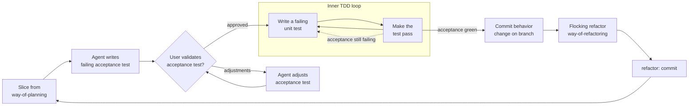

When implementing a feature or behavior change requested by the user, follow this outer acceptance loop with an inner unit TDD cycle.

**Planning:** slice sequencing happens upstream, in `way-of-planning`. Enter this loop once per approved slice, never with a horizontal layer stack spanning several slices.

**After green:** commit the behavior change first. Then flock alike code per rule of refactoring and land a separate `refactor:` commit. Do not mix structural cleanup into the behavior commit.

Do **not** jump straight into production code. Start with an acceptance test and validate it with the user. Then drive the inner red-green loop until that acceptance test passes. The refactor pass comes after the commit, per `rules-of-refactoring`.

## Rules

1. **Take a slice** — Take one approved slice from `way-of-planning` (or a direct ask too small to need a plan). Do not treat it as an implementation plan.
2. **Write a failing acceptance test** — Prefer an integration/acceptance-style test that expresses the desired external behavior. It must fail for the right reason before any production change. Name it as a business promise, per `smelly-test`.
3. **Validate with the user** — Stop and show the acceptance test (and what it asserts). Wait for explicit approval or adjustment feedback. Do not enter the inner loop until approved.
4. **Adjustments** — If the user asks for changes, revise the acceptance test and prompt again. Repeat until approved.
5. **Inner TDD loop** — After approval: write a failing unit test → make it pass, per `smelly-code`, `rules-of-software-design`, and `spend`. Stay in this loop while the acceptance test still fails. Prefer keeping the green fix minimal. Do not open a structural cleanup campaign mid-red/green. If a test or fix stalls on an unresolved question about actual runtime behavior, resolve it with `hypothesize`. If it stalls on a genuine unknown that needs its own experiment, use `spike`.
6. **Outer completion** — When the acceptance test passes: commit the behavior change on the branch, then follow the rules of refactoring (flocking → separate `refactor:` commit). Then stop (or wait for the next user ask). Do not invent the next feature.
