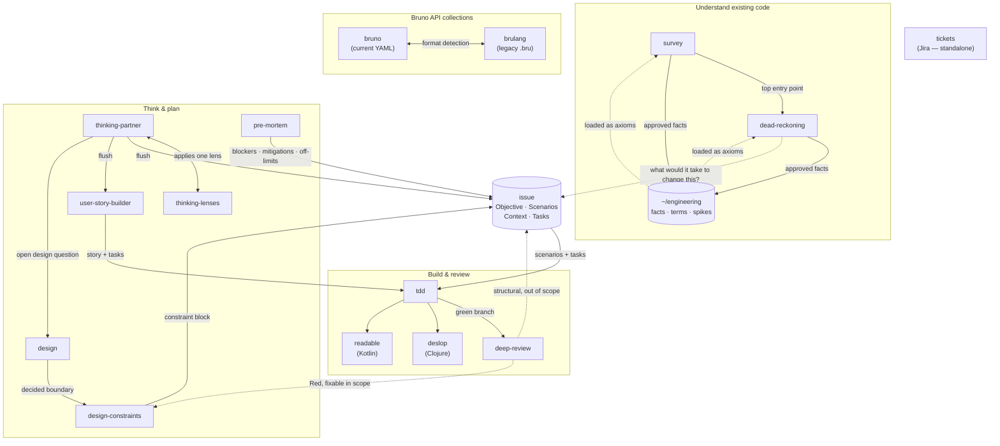

# Claude Code skills

Personal skill set used across every machine I work on. The skills are grouped
into a few pipelines that hand off to each other. The shared currency between
planning, building, and reviewing is the **`issue`** — a local markdown file
(`## Objective` · `## Scenarios` · `## Context` · `## Tasks` · `## Off-limits`)
created by the `issue` skill.

## How the skills relate

Solid arrows are the primary hand-off; dashed arrows are conditional or
feedback paths.

## The pipelines

**Understand existing code** — `survey` discovers an unfamiliar repo and names
the highest-signal questions; `dead-reckoning` traces a specific question to
behavioral claims anchored in code. Both load and (on approval) append to the
knowledge base under `~/engineering/`. A finding that turns into work feeds the
`issue` skill.

**Think & plan** — `thinking-partner` (optionally reaching for one
`thinking-lenses` lens) explores a problem and produces a *flush*. The flush
hands off to `issue` (technical work with BDD scenarios) or `user-story-builder`
(user-facing stories). `design` settles boundaries/interfaces and feeds
`design-constraints`, which emits a constraint block into the issue's
`## Context`. `pre-mortem` projects failure modes into the issue's
open questions, context, and off-limits.

**Build & review** — `tdd` reads the active issue and implements its scenarios
test-first. When the branch is green it goes to `deep-review` (architecture, any
language) and, by language, `deslop` (Clojure) or `readable` (Kotlin). A `Red`
review loops back through `design-constraints` + `tdd`, or spawns a fresh
`issue`.

**Bruno API collections** — `bruno` handles the current YAML / OpenCollection
format; `brulang` handles the legacy `.bru` markup. Pick by detecting the
collection's file layout.

**`tickets`** is standalone — it formats Jira tickets and is not part of the
local `issue`-driven flow.

## Agents

`survey`, `dead-reckoning`, and `deep-review` each have a matching subagent in
[`agents/`](agents/). The like-named skill is a thin dispatch shim that runs the
heavy work in an isolated context and surfaces only the structured report.
