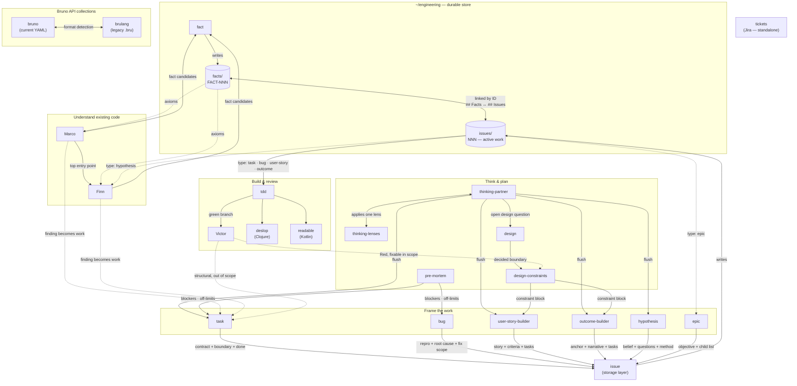

# Claude Code skills

Personal skill set used across every machine I work on. The skills are grouped
into a few pipelines that hand off to each other around two durable artifacts
kept under `~/engineering/`:

- **issues** (`~/engineering/issues/`) — the tracker for work to be done. Each
  issue has a `type` set by the framing skill that created it: `task`, `bug`,
  `user-story`, `outcome`, `hypothesis`, or `epic`. The `issue` skill is a pure
  storage layer; framing skills shape the content before handing off to it.
  Issues are archived by hand when done.
- **facts** (`~/engineering/facts/`) — a durable, sourced knowledge base. Each
  fact is `FACT-NNN`, created by the `fact` skill. Facts and issues cross-link
  by ID: an issue's `## Facts` lists the facts it relies on, and each fact's
  `## Issues` lists the issues that reference it.

(`~/engineering/` also holds `thinking/` and `spikes/`, written by
`thinking-partner` and Finn respectively.)

## How the skills relate

Solid arrows are the primary hand-off; dashed arrows are conditional or
feedback paths.

## The pipelines

**Understand existing code** — Marco surveys an unfamiliar repo (zone discovery
+ DDD map) and names the highest-signal questions; Finn traces a specific
question to behavioral claims anchored in code. Both load facts as axioms before
reading code, and route approved findings back through the `fact` skill. A
finding that turns into work spawns a `task` issue.

**Facts & issues** — the `fact` skill records durable, sourced knowledge
(`FACT-NNN`) and links it to the issues that depend on it. The `issue` skill is
a pure storage layer: it allocates an ID, links known facts, and writes the
file. All framing happens upstream in a dedicated skill before `issue` is
invoked.

**Framing skills** — each skill shapes a raw problem into the right kind of
tracked issue and then hands off to `issue` for storage:

| Skill | Issue type | Use when |
|---|---|---|
| `task` | `task` | Work is concrete and well-understood — just needs bounding |
| `bug` | `bug` | Something is broken; needs a reproduction path and fix scope |
| `user-story-builder` | `user-story` | User-facing feature shaped from a persona perspective |
| `outcome-builder` | `outcome` | Outcome matters more than mechanism; prevents LLM anchoring |
| `hypothesis` | `hypothesis` | Something unknown must be found out before building |
| `epic` | `epic` | Work is too large for one issue; decomposes into child issues |

**Think & plan** — `thinking-partner` (optionally reaching for one
`thinking-lenses` lens) explores a problem and produces a *flush*. The flush
hands off to the appropriate framing skill. `design` settles
boundaries/interfaces and feeds `design-constraints`, which emits a constraint
block into the framing skill's context. `pre-mortem` projects failure modes
into off-limits entries before framing begins.

**Build & review** — `tdd` reads an active `task`, `bug`, `user-story`, or
`outcome` issue and implements it test-first, treating `## Facts` as
established ground. `hypothesis` issues route to Finn instead; findings become
facts via the `fact` skill. When a branch is green it goes to Victor
(architecture review, any language) and, by language, `deslop` (Clojure) or
`readable` (Kotlin). A `Red` review loops back through `design-constraints` +
`tdd`, or spawns a fresh `task`.

**Bruno API collections** — `bruno` handles the current YAML / OpenCollection
format; `brulang` handles the legacy `.bru` markup. Pick by detecting the
collection's file layout.

**`tickets`** is standalone — it formats Jira tickets and is not part of the
local `issue`-driven flow.

## Agents

Four subagents live in [`agents/`](agents/) and are invoked automatically by
name or explicitly ("call Finn to…"):

| Agent | Trigger |
|---|---|
| **Marco** | Survey repo, map domains, DDD analysis |
| **Finn** | Trace how something works, investigate code behavior |
| **Victor** | Review a branch, architectural depth, pre-merge verdict |
| **Mira** | Curate the engineering vault — recall what's known, and ingest new knowledge as linked Zettelkasten notes |

## Storage config

Issues default to `~/engineering/issues/` and facts to `~/engineering/facts/`.
A repo can override either by committing a `.skills/config` file with
`issues=<path>` and/or `facts=<path>` (relative paths resolve from the repo
root) — useful for keeping a project's issues and facts in-tree.
