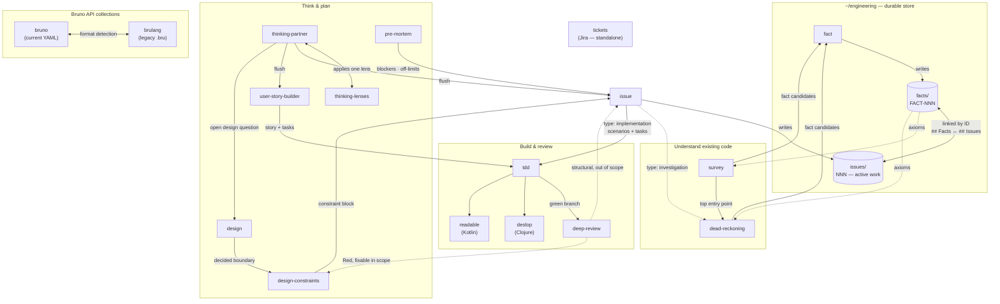

# Claude Code skills

Personal skill set used across every machine I work on. The skills are grouped
into a few pipelines that hand off to each other around two durable artifacts
kept under `~/engineering/`:

- **issues** (`~/engineering/issues/`) — the tracker for work to be done. Each
  issue is `type: implementation` (code to build) or `type: investigation` (a
  question to answer). Created by the `issue` skill; archived by hand when done.
- **facts** (`~/engineering/facts/`) — a durable, sourced knowledge base. Each
  fact is `FACT-NNN`, created by the `fact` skill. Facts and issues cross-link
  by ID: an issue's `## Facts` lists the facts it relies on, and each fact's
  `## Issues` lists the issues that reference it.

(`~/engineering/` also holds `thinking/` and `spikes/`, written by
`thinking-partner` and the `dead-reckoning` agent respectively.)

## How the skills relate

Solid arrows are the primary hand-off; dashed arrows are conditional or
feedback paths.

## The pipelines

**Understand existing code** — `survey` discovers an unfamiliar repo and names
the highest-signal questions; `dead-reckoning` traces a specific question to
behavioral claims anchored in code. Both load facts as axioms before reading
code, and route approved findings back through the `fact` skill. A finding that
turns into work feeds the `issue` skill.

**Facts & issues** — the `fact` skill records durable, sourced knowledge
(`FACT-NNN`) and links it to the issues that depend on it. The `issue` skill
shapes work into a tracked issue, classifies it as **investigation** (answered by
`dead-reckoning`, completed by recording facts) or **implementation** (answered by
`tdd`), and lists the facts it relies on. The two stores stay navigable from
either side.

**Think & plan** — `thinking-partner` (optionally reaching for one
`thinking-lenses` lens) explores a problem and produces a *flush*. The flush
hands off to `issue` (technical work with scenarios) or `user-story-builder`
(user-facing stories). `design` settles boundaries/interfaces and feeds
`design-constraints`, which emits a constraint block into the issue's
`## Context`. `pre-mortem` projects failure modes into the issue's open
questions, context, and off-limits.

**Build & review** — `tdd` reads an active implementation issue and implements
its scenarios test-first, treating its `## Facts` as established ground. When the
branch is green it goes to `deep-review` (architecture, any language) and, by
language, `deslop` (Clojure) or `readable` (Kotlin). A `Red` review loops back
through `design-constraints` + `tdd`, or spawns a fresh `issue`.

**Bruno API collections** — `bruno` handles the current YAML / OpenCollection
format; `brulang` handles the legacy `.bru` markup. Pick by detecting the
collection's file layout.

**`tickets`** is standalone — it formats Jira tickets and is not part of the
local `issue`-driven flow.

## Agents

`survey`, `dead-reckoning`, and `deep-review` each have a matching subagent in
[`agents/`](agents/). The like-named skill is a thin dispatch shim that runs the
heavy work in an isolated context and surfaces only the structured report.

## Storage config

Issues default to `~/engineering/issues/` and facts to `~/engineering/facts/`.
A repo can override either by committing a `.skills/config` file with
`issues=<path>` and/or `facts=<path>` (relative paths resolve from the repo
root) — useful for keeping a project's issues and facts in-tree.
