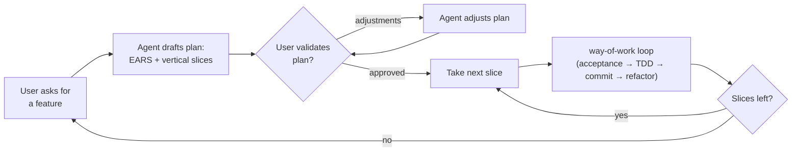

Before entering way-of-work for a new feature or behavior change, agree on a minimal plan with the user first. Skip this rule for a direct ask too small to need a plan — a one-line fix has no slices to sequence. The plan is a kickstart, not a spec. The acceptance tests written per slice inside way-of-work are the real documentation. Keep the plan short enough to fit in one message: EARS requirements plus an ordered list of vertical slices.

If the causal model of the change is not yet agreed, align with `change-frame` before drafting the plan. This applies when the user describes a goal without having decided the shape. Do not guess at a model. If the user wants a durable, file-tracked plan of failing tests instead of this inline sketch, use `propose`. This rule covers the everyday, ephemeral case that never leaves the conversation.

**EARS requirements** — phrase each line so it maps 1:1 onto a future acceptance test. A line that cannot become a test is not tight enough to plan against:
- Ubiquitous: `THE <system> SHALL <response>`
- Event-driven: `WHEN <trigger>, THE <system> SHALL <response>`
- Unwanted behavior: `IF <condition>, THEN THE <system> SHALL <response>`
- State-driven: `WHILE <state>, THE <system> SHALL <response>` — only if the feature has real states

**Slices** — sequence the requirements into vertical tracer-bullet slices, one end-to-end behavior per slice, same cut as way-of-work's planning rule. Order so each slice can go green without breaking a prior one.

## Rules

1. **User ask** — treat the request as a feature/outcome, not an implementation plan.
2. **Draft the plan** — EARS requirements plus an ordered list of vertical slices, written inline in the conversation. No file, no frontmatter: this is scratch, not a deliverable in itself.
3. **Validate with the user** — stop and show the plan. Wait for explicit approval or adjustment feedback. Do not start executing slices until approved.
4. **Adjustments** — if the user asks for changes, revise the plan and prompt again. Repeat until approved.
5. **Execute slice-by-slice** — once approved, take slices in order. Each slice enters the way-of-work loop independently (acceptance test → validate → inner TDD loop → commit → refactor). Do not pre-write acceptance tests in the plan itself — that belongs to way-of-work's step 2, one slice at a time.
6. **Re-plan on divergence** — if executing a slice reveals the plan's shape was wrong, stop, revise the plan, and re-validate the delta before continuing. Do not silently patch the plan or push ahead on a stale shape.
7. **Completion** — when all slices are done, stop. Do not invent additional slices or features beyond the validated plan.
