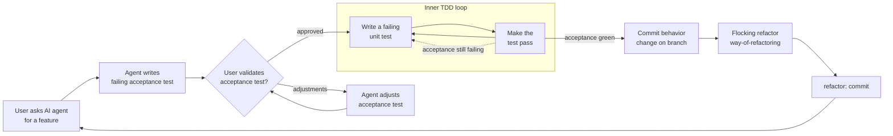

When implementing a feature or behavior change requested by the user, follow this outer acceptance loop with an inner unit TDD cycle.

**Planning:** sequence plans as vertical tracer-bullet slices — one end-to-end behavior per iteration — before entering this loop. Do not plan horizontal layer stacks that only connect at the end.

**After green:** commit the behavior change first, then flock alike code per rule of refactoring and land a separate `refactor:` commit — do not mix structural cleanup into the behavior commit.

Do **not** jump straight into production code. Start with an acceptance test, validate it with the user, then drive the inner red-green loop until that acceptance test passes (refactor pass is post-commit; use rules-of-refactoring).

## Rules

1. **User ask** — Treat the request as a feature/outcome, not an implementation plan.
2. **Write a failing acceptance test** — Prefer an integration/acceptance-style test that expresses the desired external behavior. It must fail for the right reason before any production change.
3. **Validate with the user** — Stop and show the acceptance test (and what it asserts). Wait for explicit approval or adjustment feedback. Do not enter the inner loop until approved.
4. **Adjustments** — If the user asks for changes, revise the acceptance test and prompt again. Repeat until approved.
5. **Inner TDD loop** — After approval: write a failing unit test → make it pass. Stay in this loop while the acceptance test still fails. Prefer keeping the green fix minimal; do not open a structural cleanup campaign mid-red/green.
6. **Outer completion** — When the acceptance test passes: commit the behavior change on the branch, then follow the rules of refactoring (flocking → separate `refactor:` commit). Then stop (or wait for the next user ask). Do not invent the next feature.
