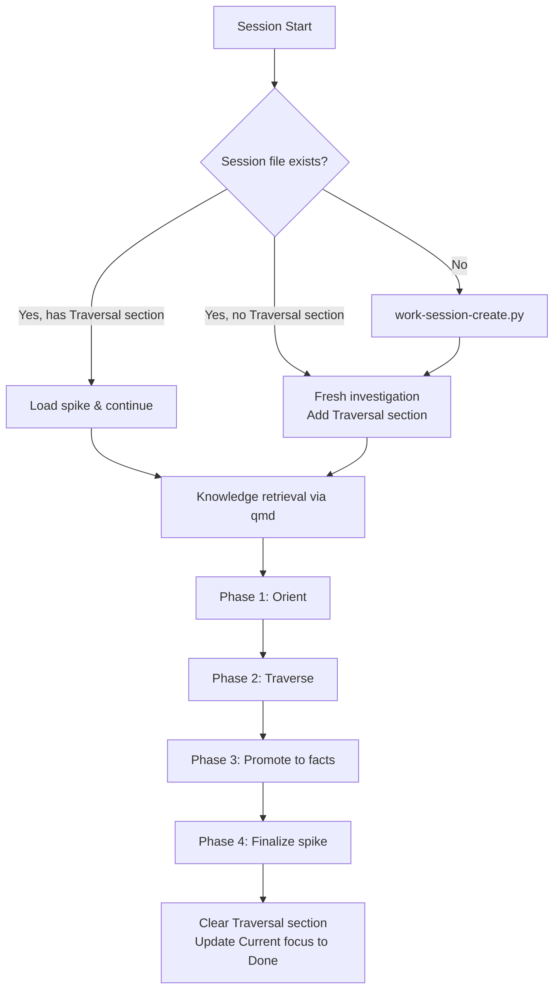
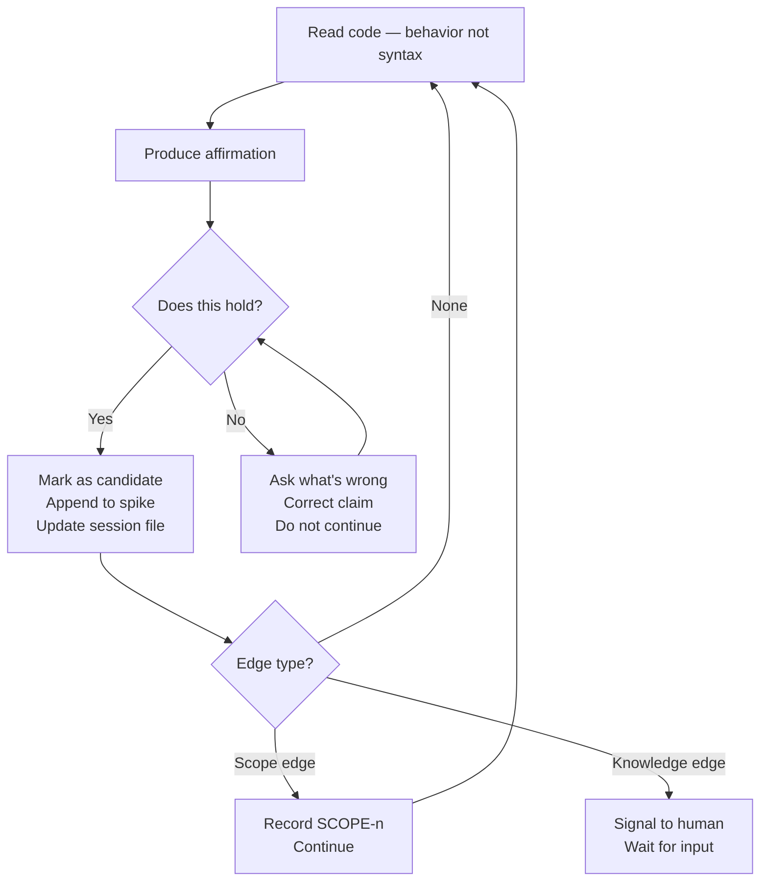

# Dead Reckoning — Legacy Analysis

## Session flow



## Storage layout

```
~/.work/
  sessions/
    NNN-<repo>.md         ← workflow session file, owns ## Traversal during investigation

~/.knowledge/
  facts/
    FACT-NNN-slug.md      ← validated facts, global, permanent
  spikes/
    NNN-slug.md           ← this session's spike document
```

The spike document is the narrative output of this skill.
Facts are atoms promoted from the spike into the permanent library.
Traversal state (affirmations, scope records, dynamic paths) lives in `## Traversal`
inside the workflow session file — not in the worktree.

See the `knowledge` skill for fact format and promotion protocol.
See the `workflow` skill for the session file schema.

## Session file during traversal

Dead reckoning adds two things to the workflow session file: it manages `## Current focus`
to reflect investigation phases, and it owns a `## Traversal` section for ephemeral state.

```markdown
## Current focus

### Done
- [x] Phase 1: Orient — central question confirmed

### In progress
- [ ] Phase 2: Traverse — entry: src/auth/token.clj:refresh-token

### Next
- [ ] Phase 3: Promote to facts
- [ ] Phase 4: Finalize spike

## Traversal

**Spike:** ~/.knowledge/spikes/001-auth-investigation.md
**Central question:** Does token refresh happen before expiry validation?

### Pending affirmations

[A1] Auth middleware checks expiry before delegating to refresh handler
     ↳ Anchored at: src/auth/middleware.clj:47
     ↳ Status: candidate for promotion

### Scope records

[SCOPE-1] Did not traverse: billing integration
           Reason: out of scope
           Risk: billing may depend on token state

### Dynamic paths

[DYNAMIC-1] Dynamic dispatch at: src/auth/handler.clj:23
             Cannot resolve statically. Human verification required.
```

`work-recall.py` injects `## Current focus` after every tool call, giving the agent
continuous phase awareness without reading the full session file.

## Session start

1. Find the workflow session for this card:
   ```bash
   python3 $SCRIPTS/work-card-list.py --status active --format json
   ```
   Read the card's `sessions:` field to locate the session file.

2. Read the session file at `~/.work/sessions/<id>-<repo>.md`.
   - Has `## Traversal` section → ongoing investigation. Load the spike from the path
     in `**Spike:**` and continue from where it left off.
   - No `## Traversal` section → fresh investigation. Add the section before starting.

3. If no session file exists, create one:
   ```bash
   python3 $SCRIPTS/work-session-create.py \
     --card <id> --repo <repo> --branch <branch> --worktree /abs/path
   ```

4. Run knowledge retrieval:
   ```bash
   qmd query "<investigation topic>" --min-score 0.5 -n 6 --files
   ```
   Load relevant facts silently. If a fact is directly relevant to the central question,
   surface it to the human before traversal begins:
   > "FACT-007 covers auth token refresh in this system. Should I treat it as an axiom
   > for this session, or do you want to verify it fresh?"

5. Rewrite `## Current focus` and `## Traversal` in the session file before any tool call.

**If no card exists yet:** create one first with `work-card-create.py`, then create the session.

**If no system name is clear:** ask "What system is this?" before anything else.

## Phase 1 — Orient

**Identify the central question.** A topic is not a question. If the input is vague:

> "That's a topic, not a question. What would a good answer look like — something like
> 'Does X happen before Y?' or 'Who owns Z when W occurs?'"

A good central question has a factual or yes/no answer, narrow enough for one session.
Once confirmed, write it at the top of the spike document and in `**Central question:**`
in the `## Traversal` section.

**Declare entry points.** Before touching code:

> "I'll start at {entry point} because {reason}. Does that make sense?"

Wait for confirmation or redirection.

**Update session file:** move Phase 1 to `### Done` in `## Current focus`. Move Phase 2
to `### In progress` with the confirmed entry point.

## Phase 2 — Traverse

Core loop. Repeat until the central question is answered or a genuine edge is reached.



**Traverse one step.** Read code. Understand behavior, not syntax.

**Produce an affirmation** — a plain-language behavioral claim, not a code description:

```
[A{n}] {Behavioral claim at business or architecture level}
       ↳ Anchored at: {file:line or function name}
       ↳ Depends on: {FACT-NNN or prior affirmation — omit if none}
```

**Pause and ask: "Does this hold?"** Wait for a real answer.

- Yes → mark as candidate for promotion. Append to spike document. Add to
  `### Pending affirmations` in `## Traversal`.
- No → stop. Ask what's wrong. Correct and re-ask. Do not continue until resolved,
  or human explicitly says "set it aside and keep going."

**Record ignored scope** before moving past any branch:

```
[SCOPE-{n}] Did not traverse: {branch or function}
             Reason: {out of scope | separate spike | depth limit}
             Risk: {what we might be missing}
```

**Flag dynamic paths:**

```
[DYNAMIC-{n}] Dynamic branch at: {location}
               Cannot resolve statically. Human verification required.
```

**Reference existing facts explicitly.** When relying on a loaded fact:

> "I'm relying on FACT-007 — '{fact statement}'. Is that still accurate?"

If invalidated: update the fact per the `knowledge` skill protocol immediately.
Treat dependent affirmations as suspect until re-verified.

**Lens triggers.** During traversal, two situations warrant offering a lens:

- An affirmation reveals something recurring — the same pattern appearing in multiple
  places, or a fix that feels like a patch on a deeper issue:
  > "This looks structural — the same problem appearing in three different places.
  > Want to run the Iceberg lens before we continue?"

- An architectural decision is encountered — a design choice about coupling, boundaries,
  or how two parts of the system interact:
  > "This is a design decision worth examining. Want to run 'What Is Braided Here?'
  > on how these two concerns are coupled?"

Do not run lenses automatically. Offer them. Wait for the human to decide.

**Update the session file** after every validated affirmation, scope/dynamic record,
and fact confirmation or invalidation. Rewrite `## Traversal` in full — never append.

**Signal edges clearly:**

- *Scope edge* — chose not to go further: note in `### Scope records`, continue.
- *Knowledge edge* — cannot go further: say so explicitly, wait for human.

Never conflate these.

## Phase 3 — Promote to facts

For each candidate affirmation in `### Pending affirmations`:

> "Candidate: '{statement}' — anchored at {commit hash or file:line}.
> Promote to a permanent fact?"

If confirmed, invoke the `knowledge` skill promotion protocol.
Unconfirmed candidates stay in the spike as narrative — not promoted.

Update `## Traversal` to reflect which affirmations have been promoted.

## Phase 4 — Finalize spike

1. Write the **Answer** section in the spike document — response to the central
   question, referencing affirmation IDs and fact IDs.
2. Write the **Open Questions** section — genuine unknowns reached but not resolved.
   (Not "we didn't look" — that's Ignored Scope.)
3. Add the spike path to the originating card's `spikes:` field.
4. Report to human: question answered or not, open questions, facts promoted.
5. Clear `## Traversal` from the session file — state now lives in the spike and
   the knowledge library.
6. Update `## Current focus`: move all phases to `### Done`. If the card has
   remaining tasks, pull the next one into `### In progress`. If this was the
   entire card, signal: "Investigation complete. Ready for planning."

## Spike document format

```markdown
# {Investigation title}

**Central question:** {One sentence.}
**Date:** YYYY-MM-DD
**Card:** {card id if applicable}

## Answer

{Response to the central question. References [A-n] and FACT-NNN.}

## Traversal map

{Entry points and path taken.}

## Affirmations

[A1] ...
[A2] ...

## Ignored scope

[SCOPE-1] ...

## Dynamic paths

[DYNAMIC-1] ...

## Facts promoted this session

- FACT-NNN — {one-line summary}

## Open questions

{Genuine unknowns not resolved.}
```

## What this skill does not do

- Does not begin traversal without a confirmed central question.
- Does not continue past a rejected affirmation without resolution.
- Does not append to the session file's `## Traversal` — always fully rewritten.
- Does not invent facts — only the human confirms external truths.
- Does not promote unconfirmed candidates to the knowledge library.
- Does not run thinking lenses automatically — offers them at the right moment.
- Does not create files in the worktree — all state lives in `~/.work/sessions/`.
